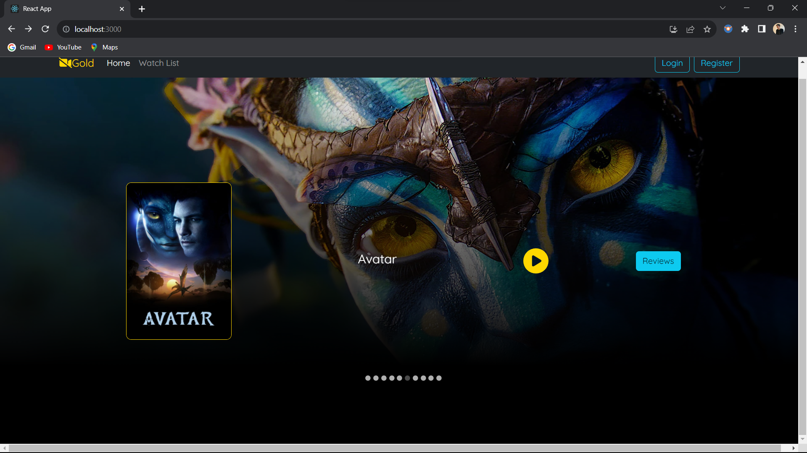
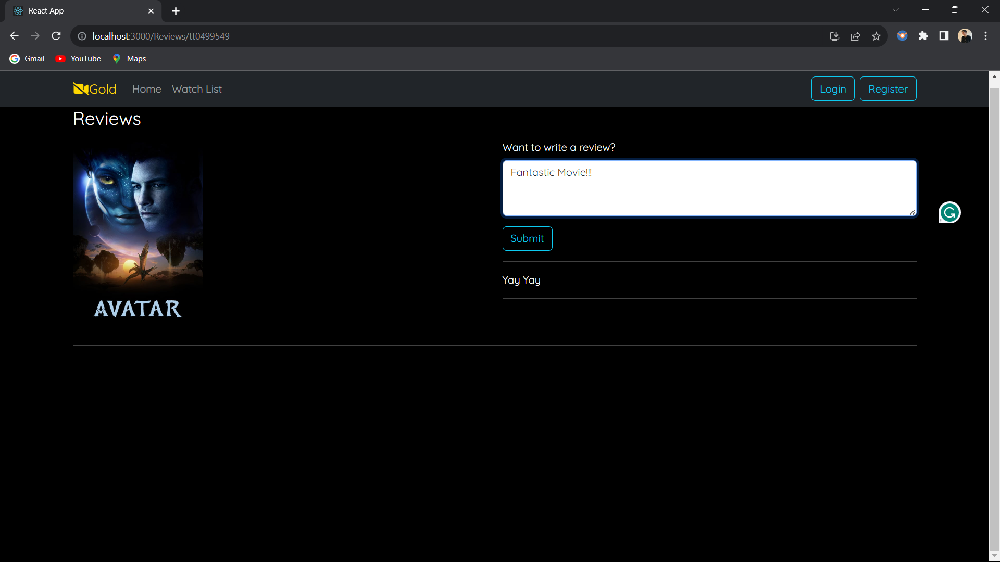
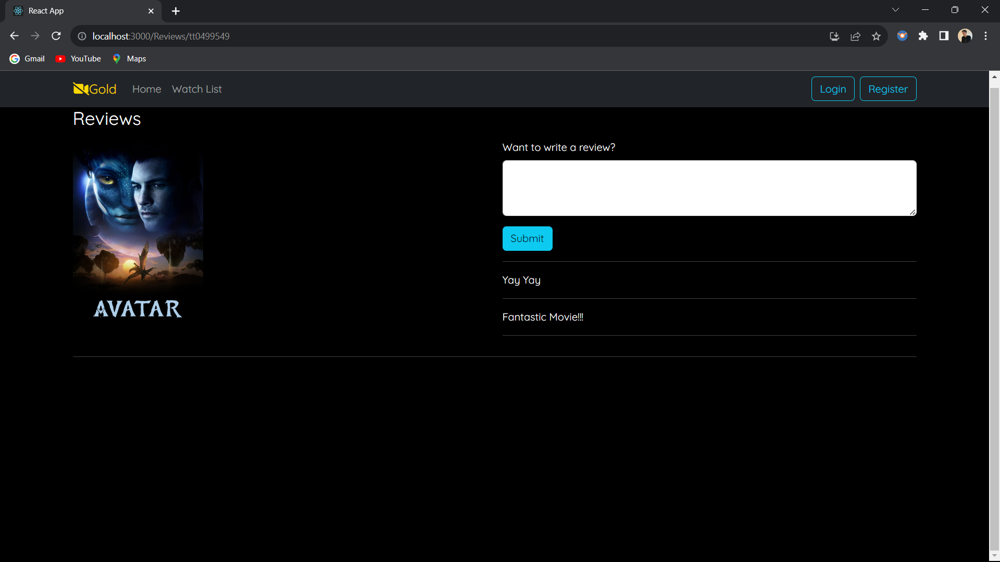

# Movie Display Project

Welcome to the Movie Display project! This full-stack application allows users to explore a collection of movies, watch trailers, and read and submit reviews. The project utilizes a MongoDB cluster for data storage, with a Java-based Spring Boot API serving as the backend and a React, Node.js, and Bootstrap-powered frontend.

## Table of Contents

- [Project Overview](#project-overview)
- [Screenshots](#screenshots)
- [Installation](#installation)
- [Usage](#usage)
- [Technologies Used](#technologies-used)

## Project Overview

The primary goal of this project is to provide users with a visually appealing interface to explore and interact with a collection of movies. The main features include:

- **Header**: Displays the website name on the left and registration and login buttons on the right.

- **Main Body**: Features a slider showcasing all movies from the database. Each movie has a big backdrop in the background, a small poster in the middle, a play button for trailers, and a review button to view past reviews.

- **Movie Details Page**: Clicking on a movie opens a details page with the particular movie's poster. Users can play the trailer and view and submit reviews.

- **Reviews Page**: Displays a white text box to add new reviews and lists all existing reviews underneath. When a user submits a new review, it immediately updates to appear under all reviews.

## Screenshots




## Installation

1. Clone the repository.
   ```bash
   git clone https://github.com/jaydeepsinh9/Movies.git
   ```

2. Navigate to the project directory.
   ```bash
   cd Movies
   ```

3. Install dependencies for both the backend and frontend.
   ```bash
   # Install backend dependencies
   cd backend
   mvn install

   # Install frontend dependencies
   cd ../frontend
   npm install
   ```

4. Set up the MongoDB cluster and configure the database connection in the backend.

## Usage

1. Run the backend server.
   ```bash
   # Inside the backend directory
   mvn spring-boot:run
   ```

2. Run the frontend.
   ```bash
   # Inside the frontend directory
   npm start
   ```

3. Open your web browser and navigate to `http://localhost:3000` to access the application.

## Technologies Used

- MongoDB
- Maven
- Java
- Spring Boot (with Lombok)
- React
- Node.js
- Bootstrap

